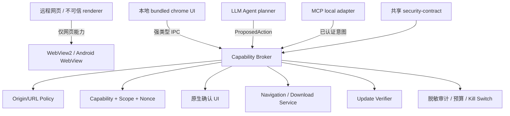

# Aegis 重构方案（Refactor Plan——按专家最终技术路线）

> 设计：2026-08-16 ｜ 依据：Aegis 最终技术路线 + 架构评估 + 技术选型复核（专家）+ 全球调研
> （英文官方 WebView2 .NET 事件/NavigationId 文档代际/PermissionRequested 权限钩子 +
> 中文 C# WebView2 混合架构/零信任权限工程——中英覆盖）
> 目标：从"永远补漏洞"转变为"架构上减少漏洞产生机会"——正确搭建整体框架

## 一、目标架构（专家最终路线——三信任域 + 能力代理）



**三个信任域**：
- 远程网页域：只渲染内容——无 native bridge/无 MCP token/无本地命令/无标签全量读取
- 本地 chrome UI 域：固定 bundled origin——仅展示/意图发起/确认——不持有全局后台权限
- Capability broker 域：唯一产生本地副作用的边界——验证来源/会话/标签代际/scope/参数/预算/批准/nonce——没有 `AuthorizedAction` 不能导航/下载/导出/改策略

**类型化安全模型**（不再用 `allow_internal: bool`/`dict[str, Any]`）：
```text
Decision = Allow(AuthorizedAction) | RequireConfirmation(ApprovalRequest) | Deny(DenyReason)
AuthorizedAction 绑定：session_id / tab_id / document_generation / origin / method /
canonical_parameters / scope / expires_at / nonce / policy_version
```

## 二、语言分工（专家路线）

| 语言 | 保留位置 | 禁止承担 |
|---|---|---|
| C#/.NET 10 | Windows host、WebView2 事件、broker adapter、原生确认 UI、发布工具 | 不在高权限进程执行 Web 内容；不用动态反射自动暴露命令 |
| Kotlin | Android UI、ViewModel、生命周期、下载/崩溃/恢复 adapter | 安全决策不藏在散落 callback；WebView 不直接读共享状态 |
| Rust | 第二阶段小型纯 URL/Origin/manifest/capability token 核心 | 第一阶段不做 Tauri UI/全量重写 |
| Python | 离线分析、开发工具、测试夹具、报告、迁移脚本 | 不作为最终 MCP 授权器/更新信任根/下载 broker/唯一 release verifier |

## 三、分阶段实施（重构方案）

### 第 0 阶段：冻结攻击面（已完成——专家审查整改落实）
- 停止新增 JS bridge/MCP tool/自动下载/自动导出/自动策略修改/pytauri command
- **Agent/MCP 网络副作用永久关闭**（broker 完成前——P0-02 未认证拒绝 + P0-03 导航层 Agent 白名单拒绝已落实）
- fail-closed 控制（P0-01 safe_url 默认拒绝/P0-04 更新契约统一/P0-06 release verify 逐文件闭合已落实）
- 远程页面无任意本地 command（P1-1 过渡：7 个桥写操作来源校验已落实）

### 第 1 阶段：Windows 壳迁移原生 WebView2（本重构方案的核心实施）
新建 **C#/.NET 10 Windows host**（`windows_host/` 目录——不叠加旧 Python 壳）：

```
windows_host/
├── Aegis.Host.csproj          # .NET 10 LTS——WebView2 SDK
├── Program.cs                 # 入口——非提权进程——浏览器主窗口
├── Broker/
│   ├── BrowserPolicyBroker.cs # 能力代理核心（唯一副作用边界）
│   ├── Decision.cs            # Decision = Allow | RequireConfirmation | Deny
│   ├── AuthorizedAction.cs    # 绑定 session/tab/document_generation/origin/scope/nonce
│   └── OriginPolicy.cs        # scheme/host/port/frame 关系校验
├── WebView/
│   ├── HostWebView.cs         # WebView2 封装——全部事件入口
│   └── NavigationHooks.cs     # NavigationStarting/FrameNavigationStarting/
│                              #   WebResourceRequested/NewWindowRequested/
│                              #   WebMessageReceived/ContentLoading/下载事件
├── ChromeUI/                  # 受信 bundled chrome UI（固定 origin——无远程注入）
└── Update/
    └── RuntimeUpdater.cs      # NewBrowserVersionAvailable 保存状态/通知/受控重启
```

**关键点（全球调研依据）**：
- `NavigationStarting` 可 disallow（block unwanted navigating——Microsoft 官方）——broker 在此做导航决策
- `NavigationId` 每次新文档变化（document_generation——与 AuthorizedAction 代际绑定一致）
- `WebResourceRequested` 可拦截/修改/阻断（AddWebResourceRequestedFilterWithRequestSourceKinds——主框架/iframe）
- `PermissionRequested` 权限钩子（Deny/Allow——最小授权——中文零信任实践）
- 远程页面**无 native bridge**（不在远程 DOM 注入 host object——XSS→RCE 风险消除——中文 TrueSight 实践）
- WebView2 Runtime 的 `NewBrowserVersionAvailable` 处理（安全更新——Microsoft 官方）

### 第 2 阶段：Android 生命周期与策略收敛
- Kotlin/Compose 保留（不重写 UI）
- TabManager/BrowserEngine 显式状态机（Active/Background/Suspended/Restoring/Crashed/Closed）
- ViewModel + SavedStateHandle 保存可恢复导航状态（不持久化密码/令牌/敏感内容）
- WebView 最小权限（JS bridge 只对 bundled origin 开放）

### 第 3 阶段：共享安全契约
- 独立 `security-contract` 包——版本化 Origin/ExternalUrl/NavigationRequest/DownloadRequest/ProposedAction/AuthorizedAction/ApprovalRequest/UpdateManifest/AuditEvent/DenyReason
- 由契约生成 C#/Kotlin/Python test model + JSON Schema——单一事实来源（不再平行 schema）

### 第 4 阶段：Rust 纯核心试点
- 试点 UpdateManifest canonicalization + Ed25519 阈值验证 或 URL/Origin canonicalization
- 无 UI/无网络/无隐式全局状态——C ABI/UniFFI 接入——收益可量化才迁移

### 第 5 阶段：恢复受控 Agent/MCP
- Agent 只生成结构化 ProposedAction（planner 非 decision maker）
- MCP 先本地受控 IPC（OS ACL/进程身份/每连接 session/nonce/撤销）——后 HTTP（OAuth 2.1/PKCE）
- 第一批只恢复只读低风险工具——高风险默认不自动化

## 四、实施顺序与验收（重构方案执行）

| 顺序 | 工作项 | 验收 |
|---|---|---|
| 1 | 第 0 阶段冻结确认（已在专家整改落实——核查） | 远程页面无任意本地 command/Agent 网络副作用关闭/fail-closed 全落实 |
| 2 | 第 1 阶段 C#/.NET 10 Windows host 最小壳 + Broker | 远程页面无 native command/导航子帧真实取消/下载判定经 broker/NewBrowserVersionAvailable 处理 |
| 3 | 第 2 阶段 Android 状态机收敛 | 旋转/后台/崩溃/下载有可见 UI 状态与安全默认值 |
| 4 | 第 3 阶段共享契约 | Schema/C#/Kotlin/Python fixture 一致/防回滚全闭合 |
| 5 | 第 4 阶段 Rust 试点 | 无 I/O 核心/与参考实现逐项一致 |
| 6 | 第 5 阶段恢复 Agent | 红队测试无未批准副作用 |

## 五、发布门禁（专家路线——逐条闭合）

代码门禁（安全核心无编译警告/敏感异常不静默）/依赖门禁（SBOM/审计）/来源门禁（远程无 bridge/消息导航经校验）/Agent 门禁（无身份 scope nonce 预算批准不执行副作用）/更新门禁（契约一致/防回滚）/运行门禁（真机 WebView2/崩溃/下载/重定向）/发布门禁（无截断扫描/无 || true/无人工覆盖）
